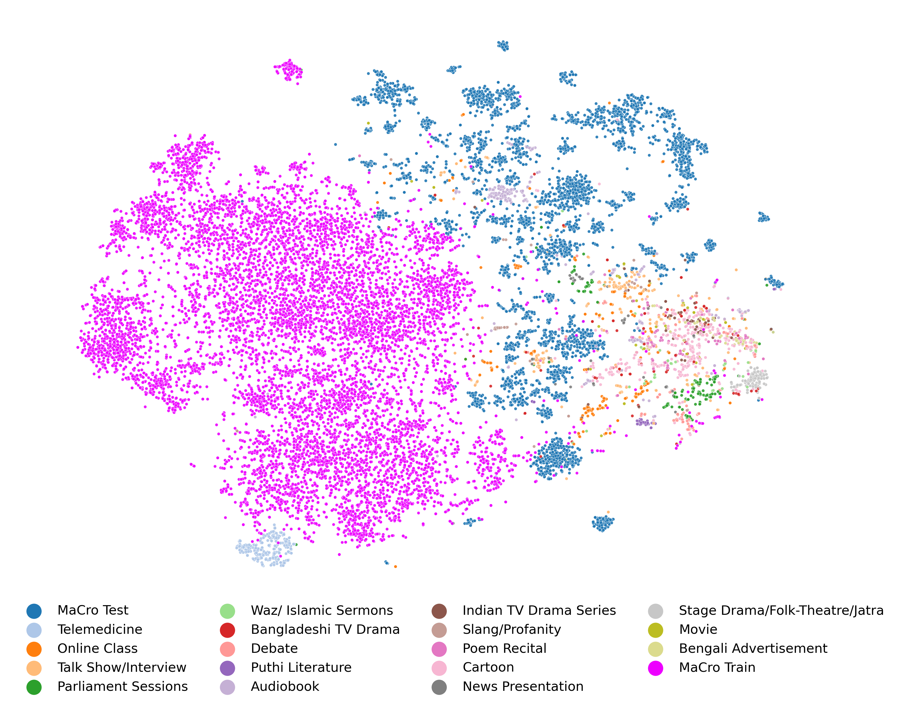

# Bengali.AI Speech Recognition [kaggle Competition](https://www.kaggle.com/competitions/bengaliai-speech)

## Goal of the Competition

The goal of this competition is to recognize Bengali speech from out-of-distribution audio recordings. You will build a model trained on the first Massively Crowdsourced (MaCro) Bengali speech dataset with 1,200 hours of data from ~24,000 people from India and Bangladesh. The test set contains samples from 17 different domains that are not present in training.

Your efforts could improve Bengali speech recognition using the first Bengali out-of-distribution speech recognition dataset. In addition, your submission will be among the first open-source speech recognition methods for Bengali.

## Why Bengali Language

Bengali is one of the most spoken languages in the world, with approximately 340 million native and second-language speakers globally. With that comes diversity in dialects and prosodic features (combinations of sounds). For example, Muslim religious sermons in Bengali are often delivered with a pace and tonality that is significantly different from regular speech. Such ‘shifts’ can be challenging even for commercially available speech recognition methods (the Google Speech API for Bengali has a Word Error Rate of 74% for Bengali religious sermons).

There are no robust open-source speech recognition models for Bengali currently, though your data science skills could certainly help change that. In particular, out-of-distribution generalization is a common machine learning problem. When test and training data are similar, they’re in-distribution. To account for Bengali’s diversity, this competition’s data is intentionally out-of-distribution, with the challenge to improve results..



## About Competition Host and sponsors

Competition host Bengali.AI is a non-profit community initiative working to accelerate language technology research for Bengali (known locally as Bangla). Bengali.AI crowdsources large-scale datasets through community-driven collection campaigns and crowdsource solutions for their datasets through research competitions. All the outcomes from Bengali.AI's two-pronged approach, including datasets and trained models, are open-sourced for public use.

## About competition data

The competition dataset comprises about 1200 hours of recordings of Bengali speech. Your goal is to transcribe recordings of speech that is out-of-distribution with respect to the training set. For more details about data collection refer to original [paper](https://arxiv.org/abs/2305.09688).

**Files and Field Descriptions**

* **train/** The training set, comprising several thousand recordings in MP3 format.
* **test/** The test set, comprising spontaneous speech recordings from eighteen domains, seventeen of which are out-of-distribution with respect to the training set. There may be domains in the private test set that are not in the public test set.
* **examples/** An example recording for each test set domain. You may find these example recordings helpful for creating models robust to domain variation. These are representative recordings and none of them are present in the test set.
* **train.csv** Sentence labels for the training set.
  * **id** A unique identifier for this instance. Corresponds to the file {id}.mp3 in train/.
  * **sentence** A plain-text transcription of the recording. Your goal is to predict these sentences for each recording in the test set.
  * **split** Whether train or valid. The annotations in the valid split have been manually reviewed and corrected, while the annotations in the train split have only been algorithmically cleaned. The valid samples will generally have higher quality annotations than the train samples, but are otherwise drawn from the same distribution.
* **sample_submission.csv** A sample submission file in the correct format. See the Evaluation page for more details.

## My cotripution

* Use CTC decoder to fine-tune wide range of pretrained checkpoints of Wave2Vec2.0 archtichtures and the work result can be found [here]().
* Use transformer decodrs to fine-tune best performed three checkpoints of Wave2Vec2.0 by start with random init decoders or init from pretrained chekpoint for bengali language and multi-lingual availabe decoders and the work result can be found [here]().
* Fine-tune SpeechT5 model with competition data and the work result can be found [here]().

For Fine-tuning this models i try to freeze specific layers from training or train some layers for num of steps and freeze them again or use loar and PEFT for larger models or try to average the activation of multible layers.

## Citation

```tex
@misc{bengaliai-speech,
    author = {Addison Howard, Ahmed Imtiaz Humayun, Ashley Chow, HCL-Jevster, Ryan Holbrook, Sushmit, Tahsin},
    title = {Bengali.AI Speech Recognition},
    publisher = {Kaggle},
    year = {2023},
    url = {https://kaggle.com/competitions/bengaliai-speech}
}
```

```tex
@article{rakib2023oodspeech,
  title={OOD-Speech: A Large Bengali Speech Recognition Dataset for Out-of-Distribution Benchmarking},
  author={Rakib, Fazle Rabbi and Dip, Souhardya Saha and Alam, Samiul and Tasnim, Nazia and Shihab, Md Istiak Hossain and Ansary, Md Nazmuddoha and Hossen, Syed Mobassir and Meghla, Marsia Haque and Mamun, Mamunur and Sadeque, Farig and others},
  journal={Proc. Interspeech 2023},
  year={2023}
}
```
